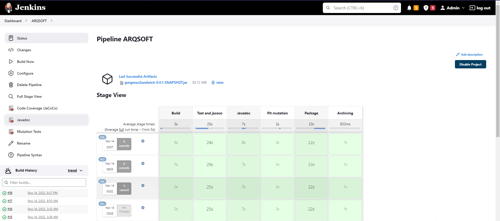
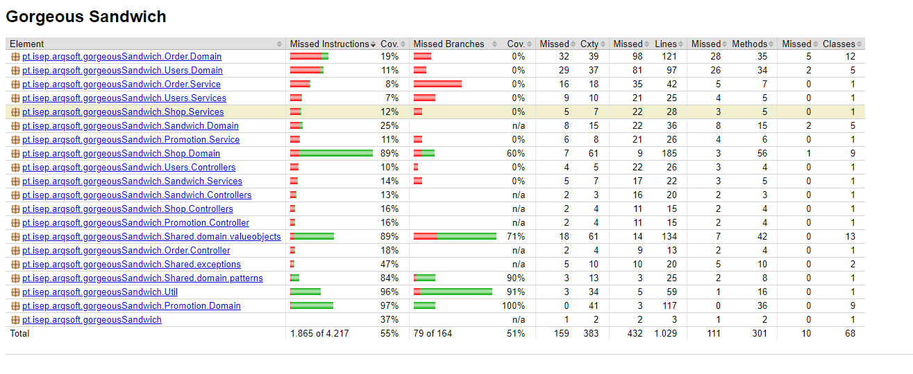
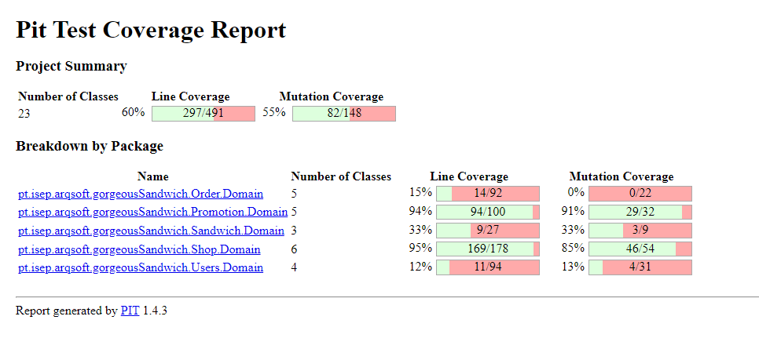
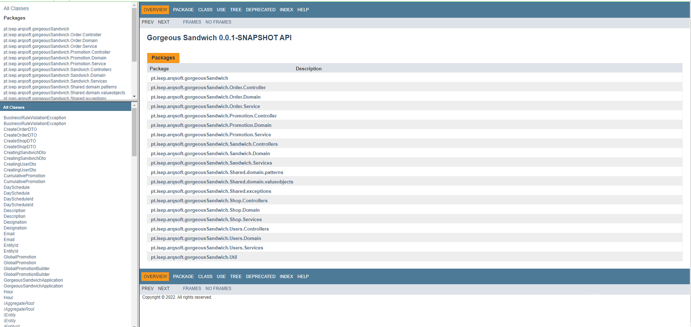

# SonographExplorer and Metrics

## SonographExplorer

The SonographExplorer app is a good tool for project validation and metric restriction.
The sonagraph project is located in [here](../ARQSOFT.sonargraph), having the quality model located [here](ARQSOFT-Quality-Model.sgqm)

### Goals to reach - Maintainability Level

The objective of the project was to achieve the maintainability of the project above the 70%. Currenttly, the project stands at 86.39%,
way above to the minimum levels.

### Other relevant metrics

Although 100% of the code was analysided, the percentage of the occurance of entagled code was of a remarkable 0.00% in any cyclic metric, not having issues from the sonograph explorer app.
The project, in the end, has an Average Complexity of only 1.73%, having 4846 lines of code

### Full Report

The full report can be found [here](html/ARQSOFT_2022-11-14_20-56-49_741.html)

## Pipeliine Integration

This project supports a Jenkins pipeline for validating, not only the tests done, but also the generation of other reports that are usefull as project metrics such as code coverage and mutation coverage.
In addition, the pipeline supports the creation of javadoc that allows for the explanation of each method, in the future.

### Java Code Coverage

Overall, the project presents a 55%~60% of coverage of used instructions and 51% of covered branches

### Mutation

Overall, the project presents a 55% mutation coverage

### Javadoc

The project also supports the generation of javadoc if need be using all the maven functionalities

